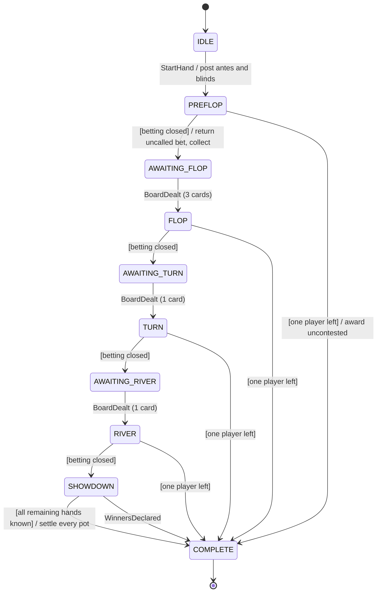

# Poker Assistant

A command-line assistant for No-Limit Texas Hold'em. You type what happens at the table; a finite-state
machine tracks the hand from the blinds to the payout (pot, side pots, whose turn it is, what is legal),
and when the action is on you it shows equity, pot odds, MDF and a recommended action with its reasoning.

> **Fair play:** most online poker sites prohibit real-time assistance software during play. Use this for
> study, hand review, training and home games, or check the rules of the room you play in.

## Quick start

Requires **JDK 21** or newer. Maven is only needed for command-line builds.

### VS Code

1. Install the **Extension Pack for Java** (`vscjava.vscode-java-pack`). VS Code suggests it when you
   open the folder, because it is listed in `.vscode/extensions.json`.
2. *File > Open Folder* the `Poker Assistant` folder and wait for the Java status bar item to report
   the project as ready. The extension imports `pom.xml` and compiles as you edit, and it does not need
   Maven installed.
3. Open *Run and Debug* (`Ctrl+Shift+D`), pick **Poker Assistant (GUI)** and press `F5` to open the
   table window. **Poker Assistant** starts the CLI in the integrated terminal, where you type commands.
   The CLI cannot run in the Debug Console, which does not send keyboard input to the program.
   **Poker Assistant (no color)** passes `--no-color`.
4. **Tests:** open the *Testing* view (flask icon) and run the tree. The default **Fast tests** profile
   skips the `slow` exhaustive evaluator check. Switch to **All tests (including slow)** with
   *Test: Select Default Profile*, or from the run-button dropdown.

With Maven on your `PATH`, *Terminal > Run Task* also offers `mvn: package`, `mvn: test`,
`mvn: test (including slow)` and `run jar` (defined in `.vscode/tasks.json`).

### IntelliJ IDEA

*File > Open* the `Poker Assistant` folder (it imports as a Maven project and picks JDK 21 from the
POM). Three shared run configurations appear automatically: **Poker Assistant (GUI)** opens the table
window, **Poker Assistant** runs the CLI in the Run console, **All Tests** runs the suite.

### Command line

This needs JDK 21 and Maven on your `PATH`:

```bash
mvn package
java -jar target/poker-assistant.jar
```

Or run it without building the jar: `mvn -q compile exec:java`.

Options: `--gui` (opens the table window instead of the command line), `--no-color` (also honoured:
the `NO_COLOR` environment variable) and `--echo` (prints each input line, handy when piping a script in).

## The table window

`java -jar target/poker-assistant.jar --gui` opens a table laid out like an online poker client: seats
around a felt with you at the bottom, the board and pot in the middle, bets in front of each seat and
the dealer button.

- **Cards are clicked, not typed.** Gold dashed slots mark cards the hand needs: your two hole cards,
  the next board cards, or an opponent's face-down cards at showdown. Click one and pick from a deck
  of all 52 cards, where cards already in play are greyed out.
- **Betting** uses **Fold**, **Check / Call** and **Bet / Raise** buttons. Set the size with the slider,
  the *Min*, *⅓*, *½*, *¾*, *Pot* and *All-in* presets, or by typing an amount. Like the CLI, the buttons act
  for whoever is to act, so opponents' actions are entered the same way.
- **Advice** appears in the side panel whenever it's your turn: the recommended action, the numbers
  behind it and the reasoning. The recommended button gets a gold ring and the slider moves to the
  suggested size.
- **Undo** (`Ctrl+Z`), **Abort hand** and **Table setup** (players, stacks, blinds, ante, your seat,
  button) are at the bottom left. The hand history is under the advice.

## A hand in practice

```text
[no hand] > setup players=6 stack=100 hero=6 button=1
[no hand] > new Jh Th
Action on Seat 4 (UTG): call 1 | raise to 2..100 | fold
[#1 preflop | pot 1.5] > f r 2.5
  Seat 4 (UTG) folds
  Seat 5 (HJ) raises to 2.5
Action on HERO (seat 6, CO): call 2.5 | raise to 4..100 | fold
  ---- advice for hero --------------------------------------------
  Equity        39.5% vs 1 opponent  [Monte Carlo, 150,000 trials, +/-0.2%, 4 ms]
  Seat 5 HJ     top 21%, 249 combos (opened from HJ (top 21%))
  Pot           4 | to call 2.5 | SPR 25.0
  Hand          JTs, top 24.6% of starting hands
  Pot odds      need 38.5% to call 2.5 (1.6 : 1)
  >> FOLD    type: f
     - Fold to the open: 39.5% equity x 0.81 realization (in position, 3 players still to act) = 32.2%,
       below the 38.5% the price requires
     alt: Mix in a 3-bet bluff about a third of the time: suited and connected, it plays well when called
[#1 preflop | pot 4] > c
[#1 preflop | pot 6.5] > f f f
  -- preflop betting closed, pot 6.5
Deal the flop: flop <c1> <c2> <c3>
[#1 awaiting flop | pot 6.5] > flop 9h 8c 2h
[#1 flop | pot 6.5] > x
  ---- advice for hero --------------------------------------------
  Equity        61.5% vs 1 opponent  [exact, 230,670 showdowns, 43 ms]
  Outs          15 to a straight or better (54.1% by the river), 21 improving cards in all
  >> BET 3.3 (50% pot)    type: b 3.3
     - Semi-bluff: 15 outs to a straight or better, plus fold equity
```

Betting commands always act for whoever the machine says is to act, so a whole orbit is one line:
`f f r 2.5 c`. Amounts are street totals ("raise **to** 7.5"). Type `help` for every command, or
`help actions | ranges | showdown | setup | equity`.

| Area     | Commands |
|----------|----------|
| Hand     | `new [cards]`, `hole <cards>`, `f` `x` `c` `b <amt>` `r <amt>` `a`, `flop`/`turn`/`river`/`board <cards>`, `show <seat> <cards>`, `muck <seat>`, `winner <seat...>`, `undo`, `abort` |
| Analysis | `advise` (`?`), `equity [AsKs vs QQ+,AKs vs random board Kh7d2c]`, `odds <pot> <bet> [eq%]`, `range <seat> <range\|auto>`, `ranges` |
| Table    | `setup players=6 stack=100 sb=0.5 bb=1 ante=0 button=1 hero=3`, `stack <seat> <amt>`, `button <seat>` |
| Session  | `status`, `history`, `fsm`, `auto on\|off`, `help [topic]`, `quit` |

## Project structure

```text
Poker Assistant/
├── pom.xml                      Maven build: Java 21, JUnit 5, executable jar
├── .vscode/                     VS Code launch configs, test profiles, Maven tasks, recommended extensions
├── .run/                        shared IntelliJ run configurations (app + all tests)
├── .editorconfig                formatting rules applied by IntelliJ and VS Code (EditorConfig extension)
└── src/
    ├── main/java/com/pokerassistant/
    │   ├── App.java             entry point and command-line options
    │   ├── cards/               Card, Rank, Suit, CardMask (cards as 64-bit masks, parsing)
    │   ├── eval/                HandEvaluator: table-free 5-7 card evaluator, HandCategory
    │   ├── math/                PokerMath (pot odds, MDF, alpha, EV, implied odds, SPR), Combinatorics
    │   ├── equity/              EquityCalculator facade, ExactEnumerator, MonteCarloSimulator,
    │   │                        Range + RangeParser, StartingHandRanking, OutsCalculator
    │   ├── fsm/                 generic engine: StateMachineDefinition (builder + validation), StateMachine
    │   ├── game/                the poker hand: HandStateMachine (the FSM definition), HandContext,
    │   │                        BettingRound (no-limit rules), PotCalculator (side pots), HandSession
    │   │                        (event log, undo, atomic batches), TableConfig, Chips
    │   ├── strategy/            DecisionEngine, RangeEstimator, BoardTexture, PreflopCharts
    │   ├── cli/                 PokerCli (REPL), CommandParser, Command, ConsoleRenderer
    │   ├── gui/                 Swing table window: PokerWindow, TableView (felt), ActionBar (buttons,
    │   │                        bet slider), CardPicker, AdvicePanel, SetupDialog, BetSizing
    │   └── error/               exception hierarchy shown to the user
    └── test/java/com/pokerassistant/   JUnit 5 tests mirroring the packages above
```

Dependencies point one way: `cli` and `gui` → `strategy` → `game` and `equity` → `eval` → `cards`, with `error`
shared by all. The `fsm` engine knows nothing about poker.

## The hand state machine



`HandStateMachine` declares this table with the generic `fsm` builder; type `fsm` in the app to print it.

- **Event transitions** (`state --Event / action--> target`) are looked up by the event's exact type, so
  dispatch is deterministic. Events are immutable records in a sealed interface (`HandEvent`).
- **Completion transitions** (`state --[guard] / action--> target`) fire on their own after every event.
  They are what automate the flow: a closed betting round moves to "awaiting" the next cards, a fold
  that leaves one player ends the hand, all-in players make every street close the moment it is dealt,
  and the showdown settles itself once every remaining hand is known.
- **Validation at build time:** duplicate transitions, completion self-loops, transitions out of final
  states and unreachable states are rejected when the definition is built; a runtime guard stops
  completion cycles.
- **Event sourcing:** `HandSession` keeps each hand as its event log. Replaying the log rebuilds the hand
  exactly, which makes `undo` trivial and makes multi-action input (`f f r 2.5 c`) atomic: if any
  action is illegal, the hand is restored as if none had been typed.

**Pot tracking:** chips from finished streets are *collected*; bets on the current street stay with
each player until the round closes, when any uncalled excess goes back and the rest is collected. Side
pots are derived on demand from each player's total contribution, layer by layer, so they cannot drift.
Amounts are `Chips`, exact hundredths in a `long`, never floating point. Split pots give the odd
hundredth to the first winner left of the button.

**Betting rules enforced:** minimum bet of one big blind; minimum raise equal to the last full bet or
raise; all-in for less is always allowed; an incomplete all-in raise does not re-open betting for
players who already acted (unless the raises add up to a full one); no raising when nobody can respond;
folding only when facing a bet; the big blind's option; heads-up blind and action order.

## Equity and maths

- **Hand evaluator:** each card owns one bit of a `long` (16 bits per suit), so a hand is a mask and the
  evaluator works on four 13-bit rank sets with bit tricks, no lookup tables. The result is a single
  ordered `int`. The tests check all 2,598,960 five-card hands and all 133,784,560 seven-card hands
  against the known category frequencies.
- **Exact enumeration** (heads-up) walks every villain combo in range times every runout, in parallel.
  It is used whenever the showdown count fits a budget (3 million by default): every flop and turn
  spot against a range, and hand-vs-hand preflop.
- **Monte Carlo** covers multi-way pots and wide ranges preflop. Villain hands are dealt with whole-deal
  rejection (redrawing only the colliding player would bias the result), pot shares are summed as exact
  integers so a seed gives identical results on any machine, and the 95% margin of error is reported.
- **Ranges** accept standard notation: `QQ+`, `AKs`, `ATo+`, `KTs-K7s`, `99-66`, `AhKh`, `15%`,
  `random`. Card removal (blockers) is applied everywhere.

## How the recommendations work (and what they are not)

This is **not a solver**. It combines the building blocks GTO strategy is made of, so every
recommendation is explainable:

- **Preflop:** opening ranges by position from 100bb solver outputs (about 17% UTG to 43% on the
  button); facing a raise, equity against the raiser's estimated range is discounted for equity
  realization (in or out of position, players still to act) and compared with the pot odds. Value
  re-raises need a fixed equity edge; suited wheel aces and suited connectors get a mixed 3-bet-bluff
  suggestion.
- **Postflop:** equity against sizing-narrowed ranges versus pot odds, with MDF and bluff break-even
  shown for context; value thresholds scale with the number of opponents; bet size follows board
  texture; strong draws semi-bluff or call on implied odds; the preflop raiser range-bets small on dry
  boards; on the river, hands without showdown value check, with the balanced bluff ratio quoted as a
  guide for choosing bluffs.
- **Opponent ranges** are estimated from their actions (preflop bands of a starting-hand ranking,
  postflop narrowing by bet size). Set a range yourself with `range <seat> <notation>` when you know
  better; shown cards override everything.

Every threshold is a named constant in `DecisionEngine`, `PreflopCharts` and `RangeEstimator`, so the
model is easy to tune or to replace with real solver data.

## Tests

```bash
mvn test
```

About 200 tests: the evaluator against exhaustive enumeration, exact vs Monte Carlo agreement, range
parsing, pot odds maths, every FSM path (side pots, split pots with odd chips, incomplete all-in raises,
all-in run-outs, mucking, manual winners), undo and atomic batches, the parser's rejection of invalid
input, full CLI sessions, and a fuzz test that plays 3,000 random hands (2-10 players, short stacks,
antes, random legal and illegal actions) checking that chips are conserved at every step, rejected
actions change nothing and every hand terminates with the pot paid out.

The exhaustive seven-card check is tagged `slow` and skipped by `mvn test`; include it with
`mvn test -DexcludedGroups=none`. In VS Code, the **All tests (including slow)** test profile runs
everything; IntelliJ's **All Tests** configuration does too.

## Next steps

- Solver-backed preflop charts and postflop range narrowing per action and texture (the `RangeEstimator`
  and `PreflopCharts` seams are where they plug in).
- Weighted ranges and hero-range analysis for true MDF-based defense decisions.
- Tournament play: ICM, big-blind antes, straddles.
- Hand-history import and export.
